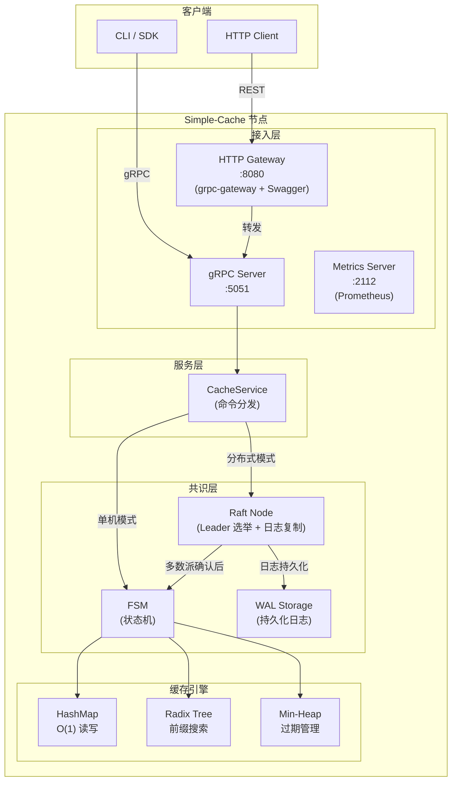
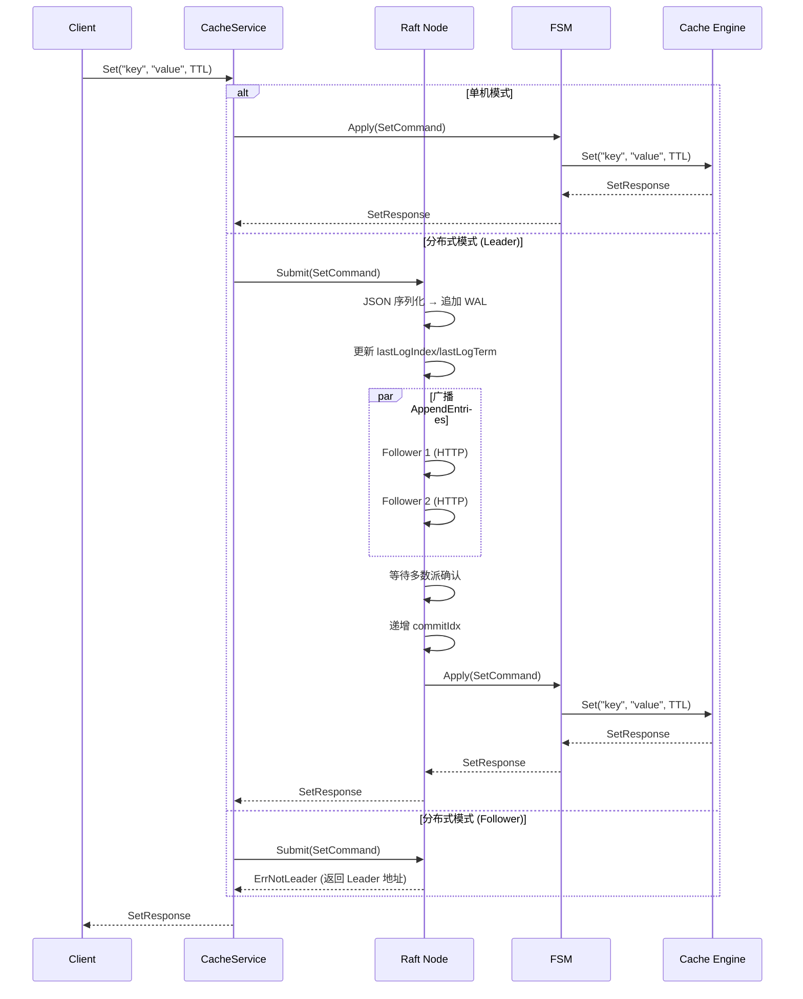
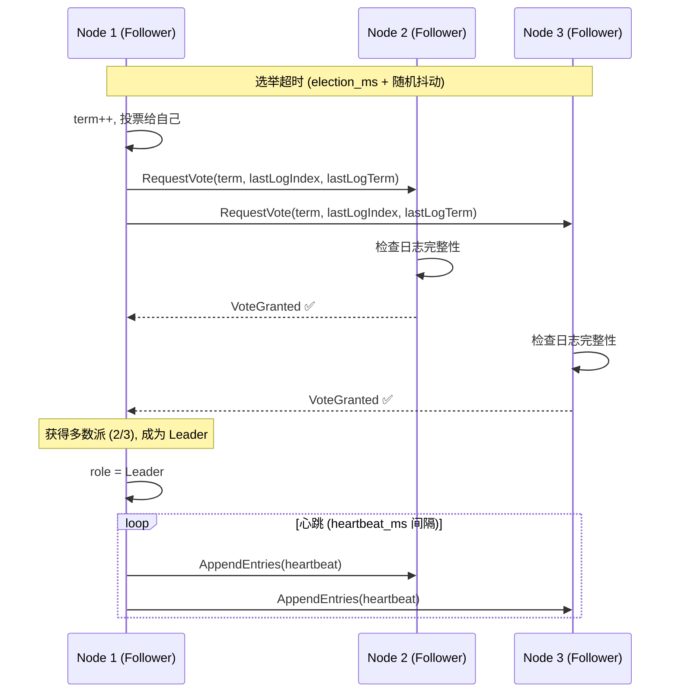
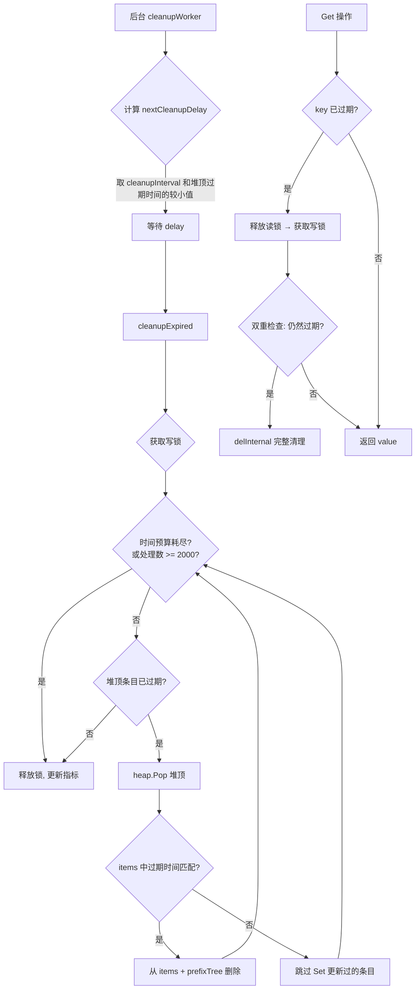
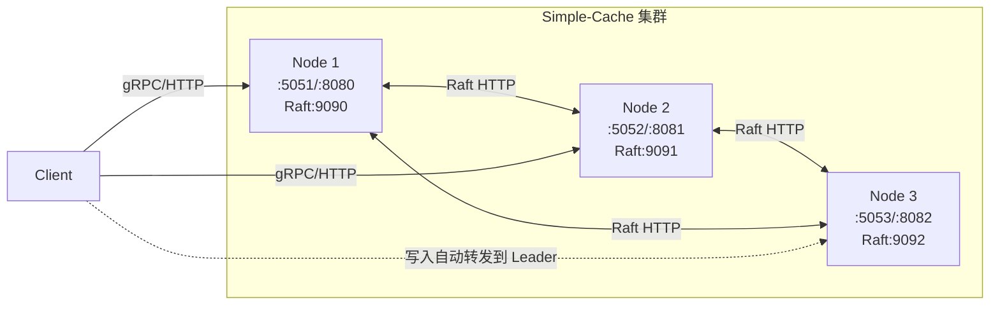
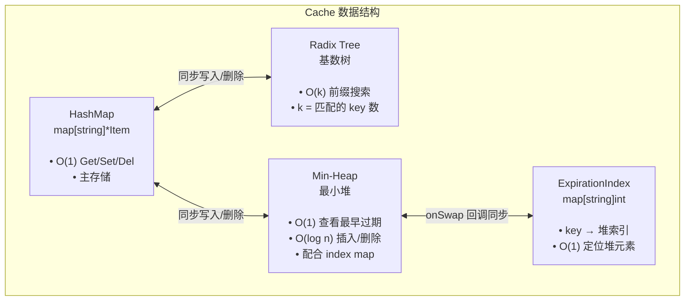
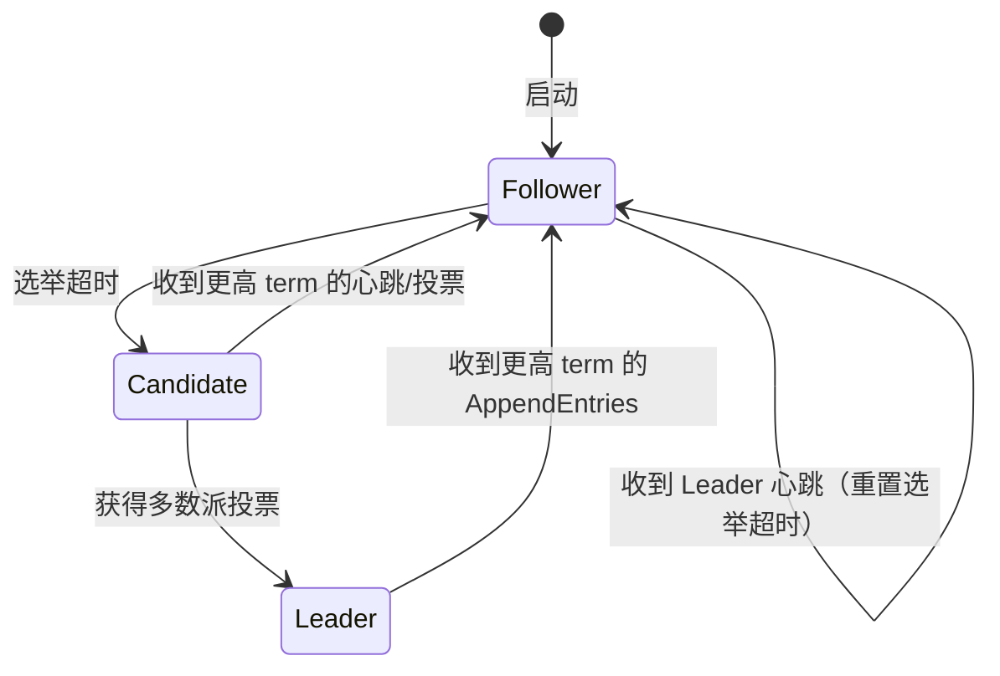

# Simple-Cache

<p align="center">
  <strong>基于 Raft 共识的分布式内存缓存系统</strong>
</p>

<p align="center">
  
  
  
  
  
</p>

---

## 目录

- [简介](#简介)
- [特性](#特性)
- [系统架构](#系统架构)
- [数据流程](#数据流程)
- [快速开始](#快速开始)
  - [环境要求](#环境要求)
  - [单机模式](#单机模式)
  - [分布式模式](#分布式模式)
- [项目结构](#项目结构)
- [API 参考](#api-参考)
  - [gRPC 接口](#grpc-接口)
  - [REST 接口](#rest-接口)
  - [集群管理接口](#集群管理接口)
  - [运维接口](#运维接口)
- [客户端 SDK](#客户端-sdk)
  - [安装](#安装)
  - [基本使用](#基本使用)
  - [批量操作](#批量操作)
  - [搜索](#搜索)
  - [过期管理](#过期管理)
- [配置说明](#配置说明)
- [分布式部署指南](#分布式部署指南)
- [监控指标](#监控指标)
- [开发指南](#开发指南)
  - [构建](#构建)
  - [测试](#测试)
  - [Proto 代码生成](#proto-代码生成)
  - [代码格式化](#代码格式化)
- [设计详解](#设计详解)
  - [缓存数据结构](#缓存数据结构)
  - [Raft 共识实现](#raft-共识实现)
  - [过期与清理机制](#过期与清理机制)
  - [搜索机制](#搜索机制)
  - [日志系统](#日志系统)

---

## 简介

**Simple-Cache** 是一个使用 Go 语言实现的分布式内存缓存系统。它采用经典的 **Command + FSM + Raft** 架构模式，通过自研的 Raft 共识算法保证分布式环境下的数据一致性。系统同时提供 gRPC 和 REST 双协议接口，内嵌 Swagger UI，集成 Prometheus 监控，支持单机和分布式两种运行模式。

## 特性

- **双协议支持** — gRPC 原生接口 + REST HTTP（通过 grpc-gateway 自动转换）
- **Raft 共识** — 自研轻量级 Raft 实现，支持 Leader 选举、日志复制、多数派提交
- **单机/分布式透明切换** — 通过配置文件一个字段即可切换模式，上层业务无感知
- **灵活的 Key 搜索** — 支持通配符（基于 Radix Tree 前缀搜索）和正则表达式两种匹配模式
- **TTL 过期机制** — 支持 Set 时设置 TTL，也支持通过 `ExpireKey` 独立设置/移除过期时间
- **智能清理** — 主动清理 + 惰性删除双重策略，时间预算控制避免阻塞
- **动态集群管理** — 通过 HTTP API 动态增删节点
- **配置热重载** — 可选的配置文件轮询热更新
- **可观测性** — Prometheus 指标（独立端口）+ 结构化日志（zap + lumberjack 日志轮转）
- **API 文档** — 内嵌 Swagger UI，启动后访问 `/api/docs/` 即可查看
- **优雅关闭** — 完整的 7 步优雅关闭流程（gRPC → Gateway → Raft → Cache → Config → Metrics → Logger）
- **客户端 SDK** — 封装完整的 gRPC 客户端，提供友好的 Go API（包括批量操作）

---

## 系统架构

### 整体架构图



### 模块职责

| 模块 | 路径 | 职责 |
|------|------|------|
| `cache` | `pkg/cache/` | 缓存引擎核心：CRUD、TTL 过期、前缀/正则搜索、指标采集 |
| `server` | `pkg/server/` | gRPC 服务层：接收请求、命令分发、模式切换 |
| `raft` | `pkg/raft/` | Raft 共识实现：Leader 选举、日志复制、多数派提交 |
| `fsm` | `pkg/fsm/` | 有限状态机：将 Raft 日志应用到缓存 |
| `command` | `pkg/command/` | 命令定义：Set/Get/Del/Expire/Reset/Search |
| `config` | `pkg/config/` | 配置管理：YAML 加载、原子配置、热重载 |
| `metrics` | `pkg/metrics/` | Prometheus 指标采集与暴露 |
| `log` | `pkg/log/` | 日志系统：zap 结构化日志 + lumberjack 轮转 |
| `client` | `pkg/client/` | gRPC 客户端 SDK |

---

## 数据流程

### 写操作流程（Set）



### Raft 选举流程



### 过期清理流程



---

## 快速开始

### 环境要求

- Go 1.24+
- Protocol Buffers 编译器 (protoc) — 仅开发时需要

### 单机模式

**1. 克隆项目**

```bash
git clone https://github.com/lushenle/simple-cache.git
cd simple-cache
```

**2. 创建配置文件**

```bash
cp config.example.yaml config.yaml
```

默认配置即为单机模式，无需修改：

```yaml
mode: single
node_id: node-1
grpc_addr: ":5051"
http_addr: ":8080"
raft_http_addr: ":9090"
metrics_addr: ":2112"
peers: []
heartbeat_ms: 200
election_ms: 1200
hot_reload: false
```

**3. 启动服务**

```bash
go run pkg/cmd/main.go
```

**4. 验证服务**

```bash
# 健康检查
curl http://localhost:8080/healthz
# 输出: ok

# 设置键值
curl -X POST http://localhost:8080/v1/mykey \
  -H "Content-Type: application/json" \
  -d '{"value": "Hello World!", "expire": "10m"}'

# 获取键值
curl http://localhost:8080/v1/mykey

# 删除键值
curl -X DELETE http://localhost:8080/v1/mykey

# 查看 Swagger API 文档
# 浏览器打开 http://localhost:8080/api/docs/
```

### 分布式模式

**1. 创建三个节点的配置文件**

```bash
# 节点 1
cat > configs/node1.yaml << 'EOF'
mode: distributed
node_id: n1
grpc_addr: ":5051"
http_addr: ":8080"
raft_http_addr: ":9090"
metrics_addr: ":2112"
peers:
  - "http://127.0.0.1:9090"
  - "http://127.0.0.1:9091"
  - "http://127.0.0.1:9092"
heartbeat_ms: 200
election_ms: 1200
EOF

# 节点 2
cat > configs/node2.yaml << 'EOF'
mode: distributed
node_id: n2
grpc_addr: ":5052"
http_addr: ":8081"
raft_http_addr: ":9091"
metrics_addr: ":2113"
peers:
  - "http://127.0.0.1:9090"
  - "http://127.0.0.1:9091"
  - "http://127.0.0.1:9092"
heartbeat_ms: 200
election_ms: 1200
EOF

# 节点 3
cat > configs/node3.yaml << 'EOF'
mode: distributed
node_id: n3
grpc_addr: ":5053"
http_addr: ":8082"
raft_http_addr: ":9092"
metrics_addr: ":2114"
peers:
  - "http://127.0.0.1:9090"
  - "http://127.0.0.1:9091"
  - "http://127.0.0.1:9092"
heartbeat_ms: 200
election_ms: 1200
EOF
```

**2. 分别启动三个节点**

```bash
# 终端 1
CONFIG_PATH=configs/node1.yaml go run pkg/cmd/main.go

# 终端 2
CONFIG_PATH=configs/node2.yaml go run pkg/cmd/main.go

# 终端 3
CONFIG_PATH=configs/node3.yaml go run pkg/cmd/main.go
```

**3. 验证集群**

```bash
# 检查节点就绪状态（返回 leader 或 follower）
curl http://localhost:8080/readyz

# 查看集群节点列表
curl http://localhost:8080/cluster/peers

# 通过任意节点的 HTTP 接口写入（会自动转发到 Leader）
curl -X POST http://localhost:8081/v1/testkey \
  -H "Content-Type: application/json" \
  -d '{"value": "distributed value"}'

# 通过另一个节点读取（数据已复制）
curl http://localhost:8082/v1/testkey
```

---

## 项目结构

```
simple-cache/
├── .github/workflows/
│   └── ci-test.yml              # CI: push/PR 时自动运行测试
├── bench/
│   └── benchmark_test.go        # 基准测试
├── configs/
│   ├── node1.yaml               # 分布式节点 1 配置示例
│   ├── node2.yaml               # 分布式节点 2 配置示例
│   └── node3.yaml               # 分布式节点 3 配置示例
├── pkg/
│   ├── cache/                   # 📦 缓存引擎核心
│   │   ├── cache.go             #   Cache 主结构 + New/Close
│   │   ├── set.go               #   Set 操作
│   │   ├── get.go               #   Get 操作 + 惰性过期删除
│   │   ├── del.go               #   Del 操作 + delInternal
│   │   ├── expiration.go        #   SetExpiration 独立设置过期
│   │   ├── cleanup.go           #   后台清理 Worker
│   │   ├── search.go            #   前缀搜索 + 正则搜索
│   │   ├── heap.go              #   过期最小堆 (container/heap)
│   │   ├── reset.go             #   Reset 清空缓存
│   │   ├── metrics.go           #   缓存大小估算
│   │   └── *_test.go            #   单元测试 + 基准测试
│   ├── client/                  # 📦 gRPC 客户端 SDK
│   │   └── client.go            #   Get/Set/Del/Search/BatchSet/ExpireKey/Reset
│   ├── cmd/                     # 📦 主程序入口
│   │   ├── main.go              #   启动流程 + 优雅关闭 + HTTP 端点
│   │   └── swagger/             #   内嵌 Swagger UI 静态文件
│   ├── command/                 # 📦 命令定义 (Command Pattern)
│   │   └── command.go           #   Set/Get/Del/Expire/Reset/Search Command
│   ├── common/                  # 📦 公共常量
│   ├── config/                  # 📦 配置管理
│   │   └── config.go            #   YAML 加载 + AtomicConfig + 热重载 Watcher
│   ├── examples/usage/          # 📦 使用示例
│   │   └── main.go
│   ├── fsm/                     # 📦 有限状态机
│   │   └── fsm.go               #   Apply(cmd) → cmd.Apply(cache)
│   ├── log/                     # 📦 日志系统
│   │   ├── log.go               #   Plugin 模式 + NewLogger
│   │   ├── default.go           #   JSON 编码 + Lumberjack 轮转
│   │   └── grpc_logger.go       #   gRPC/HTTP 拦截器日志
│   ├── metrics/                 # 📦 Prometheus 指标
│   │   └── metrics.go           #   缓存指标 + Raft 指标 + 内存指标
│   ├── pb/                      # 📦 Protobuf 生成代码
│   ├── proto/                   # 📦 .proto 源文件
│   ├── raft/                    # 📦 Raft 共识实现
│   │   ├── types.go             #   Role + AppendEntries/RequestVote 消息
│   │   ├── node.go              #   Raft 节点 (选举 + 日志复制 + 提交)
│   │   ├── storage.go           #   WAL 文件存储 + Meta 持久化
│   │   └── http_transport.go    #   HTTP 传输层 (广播 + Peer 管理)
│   ├── server/                  # 📦 gRPC 服务层
│   │   └── server.go            #   CacheService 实现
│   └── utils/                   # 📦 工具函数
├── config.example.yaml          # 配置示例
├── Makefile                     # 构建/测试/Proto 生成
├── go.mod
└── go.sum
```

---

## API 参考

### gRPC 接口

服务名：`CacheService`

| 方法 | 请求 | 响应 | 说明 |
|------|------|------|------|
| `Get` | `GetRequest{key}` | `GetResponse{value, found}` | 获取键值 |
| `Set` | `SetRequest{key, value, expire}` | `SetResponse{success}` | 设置键值（支持 TTL） |
| `Del` | `DelRequest{key}` | `DelResponse{success, existed}` | 删除键 |
| `Reset` | `ResetRequest{}` | `ResetResponse{success, keys_cleared}` | 清空缓存 |
| `Search` | `SearchRequest{pattern, mode}` | `SearchResponse{keys}` | 搜索键 |
| `ExpireKey` | `ExpireKeyRequest{key, expire}` | `ExpireKeyResponse{success, existed}` | 设置过期时间 |

**SearchRequest.MatchMode**：
- `WILDCARD (0)` — 通配符匹配（默认），支持 `*`、`?`、`[...]`
- `REGEX (1)` — 正则表达式匹配

### REST 接口

通过 grpc-gateway 自动映射，所有 gRPC 接口均可通过 HTTP 访问：

| HTTP 方法 | 路径 | 说明 |
|-----------|------|------|
| `POST` | `/v1/{key}` | 设置键值 |
| `GET` | `/v1/{key}` | 获取键值 |
| `DELETE` | `/v1/{key}` | 删除键 |
| `DELETE` | `/v1` | 清空缓存 |
| `GET` | `/v1/search/{pattern}` | 通配符搜索 |
| `GET` | `/v1/search/{pattern}/{mode}` | 按模式搜索（`wildcard` 或 `regex`） |
| `POST` | `/v1/{key}/expire` | 设置过期时间 |

**示例：**

```bash
# Set
curl -X POST http://localhost:8080/v1/greeting \
  -H "Content-Type: application/json" \
  -d '{"value": "Hello!", "expire": "5m"}'

# Get
curl http://localhost:8080/v1/greeting

# Search (wildcard)
curl http://localhost:8080/v1/search/user:*

# Search (regex)
curl http://localhost:8080/v1/search/^user:\d+$/regex

# Expire
curl -X POST http://localhost:8080/v1/greeting/expire \
  -H "Content-Type: application/json" \
  -d '{"expire": "30s"}'

# Reset
curl -X DELETE http://localhost:8080/v1
```

### 集群管理接口

| HTTP 方法 | 路径 | 说明 | 请求体 |
|-----------|------|------|--------|
| `POST` | `/cluster/join` | 加入节点 | `{"id": "n4", "addr": "http://127.0.0.1:9093"}` |
| `POST` | `/cluster/leave` | 移除节点 | `{"addr": "http://127.0.0.1:9093"}` |
| `GET` | `/cluster/peers` | 查看节点列表 | — |

### 运维接口

| HTTP 方法 | 路径 | 说明 |
|-----------|------|------|
| `GET` | `/healthz` | 健康检查（返回 `ok`） |
| `GET` | `/readyz` | 就绪检查（返回 `leader` 或 `follower`） |
| `GET` | `/metrics` | Prometheus 指标（独立端口） |
| `GET` | `/api/docs/` | Swagger UI |
| `GET` | `/swagger/` | Swagger UI（备用路径） |

---

## 客户端 SDK

### 安装

```bash
go get github.com/lushenle/simple-cache
```

### 基本使用

```go
package main

import (
    "context"
    "fmt"
    "time"

    "github.com/lushenle/simple-cache/pkg/client"
    "google.golang.org/grpc"
    "google.golang.org/grpc/credentials/insecure"
)

func main() {
    // 创建客户端
    cli, err := client.New(
        context.Background(),
        "localhost:5051",
        grpc.WithTransportCredentials(insecure.NewCredentials()),
    )
    if err != nil {
        panic(err)
    }
    defer cli.Close()

    ctx := context.Background()

    // Set — 设置键值（TTL 10 分钟）
    err = cli.Set(ctx, "greeting", "Hello World!", 10*time.Minute)
    if err != nil {
        panic(err)
    }

    // Get — 获取键值
    val, found, err := cli.Get(ctx, "greeting")
    if err != nil {
        panic(err)
    }
    if found {
        fmt.Println("Value:", val)  // Output: Value: Hello World!
    }

    // Del — 删除键
    existed, err := cli.Del(ctx, "greeting")
    if err != nil {
        panic(err)
    }
    fmt.Println("Existed:", existed)  // Output: Existed: true
}
```

### 批量操作

```go
// BatchSet — 批量设置
items := map[string]string{
    "user:1": "Alice",
    "user:2": "Bob",
    "user:3": "Charlie",
}
err := cli.BatchSet(ctx, items, 30*time.Minute)
```

### 搜索

```go
// 通配符搜索
keys, err := cli.Search(ctx, "user:*", false)
fmt.Println(keys)  // [user:1 user:2 user:3]

// 正则搜索
keys, err := cli.Search(ctx, `^user:\d+$`, true)
```

### 过期管理

```go
// 为已有 key 设置过期时间
existed, err := cli.ExpireKey(ctx, "greeting", 5*time.Second)
// existed 表示 key 是否存在

// 移除过期时间（设为永不过期）
existed, err := cli.ExpireKey(ctx, "greeting", 0)
```

### 完整方法列表

| 方法 | 签名 | 说明 |
|------|------|------|
| `New` | `New(ctx, addr, ...opts) (*Client, error)` | 创建客户端（带连接就绪检查） |
| `NewDefault` | `NewDefault(addr, ...opts) (*Client, error)` | 使用 `context.Background()` 创建 |
| `Close` | `Close() error` | 关闭连接 |
| `Get` | `Get(ctx, key) (value, found, error)` | 获取值 |
| `Set` | `Set(ctx, key, value, ttl) error` | 设置值 |
| `Del` | `Del(ctx, key) (existed, error)` | 删除值 |
| `Search` | `Search(ctx, pattern, isRegex) (keys, error)` | 搜索键 |
| `ExpireKey` | `ExpireKey(ctx, key, ttl) (existed, error)` | 设置过期时间 |
| `Reset` | `Reset(ctx) (cleared, error)` | 清空缓存 |
| `BatchSet` | `BatchSet(ctx, items, ttl) error` | 批量设置 |

---

## 配置说明

配置文件默认为 `config.yaml`，可通过环境变量 `CONFIG_PATH` 指定路径。

| 配置项 | 类型 | 默认值 | 说明 |
|--------|------|--------|------|
| `mode` | string | `single` | 运行模式：`single`（单机）/ `distributed`（分布式） |
| `node_id` | string | `node-1` | 节点唯一标识 |
| `grpc_addr` | string | `:5051` | gRPC 服务监听地址 |
| `http_addr` | string | `:8080` | HTTP 网关监听地址 |
| `raft_http_addr` | string | `:9090` | Raft 节点间通信地址 |
| `metrics_addr` | string | `:2112` | Prometheus 指标暴露地址 |
| `peers` | []string | `[]` | 集群节点 Raft HTTP 地址列表 |
| `heartbeat_ms` | int | `200` | Leader 心跳间隔（毫秒） |
| `election_ms` | int | `1200` | 选举超时基准值（毫秒），实际超时 = `election_ms + random(0..election_ms)` |
| `hot_reload` | bool | `false` | 是否启用配置文件热重载（每秒轮询） |

> **注意**：`grpc_addr`、`http_addr`、`raft_http_addr`、`metrics_addr` 在服务启动时绑定，不支持热重载。

---

## 分布式部署指南

### 架构概览



### 部署要点

1. **每个节点需要独立的端口** — gRPC、HTTP、Raft、Metrics 各自使用不同端口
2. **所有节点的 `peers` 列表必须一致** — 包含集群中所有节点的 Raft HTTP 地址
3. **建议至少 3 个节点** — Raft 需要多数派确认，2 个节点无法容忍任何故障
4. **客户端可连接任意节点** — 写入请求会自动转发到 Leader，读取请求在本地执行

### 动态扩缩容

```bash
# 向集群添加新节点
curl -X POST http://localhost:8080/cluster/join \
  -H "Content-Type: application/json" \
  -d '{"id": "n4", "addr": "http://127.0.0.1:9093"}'

# 从集群移除节点
curl -X POST http://localhost:8080/cluster/leave \
  -H "Content-Type: application/json" \
  -d '{"addr": "http://127.0.0.1:9093"}'
```

---

## 监控指标

所有指标通过独立的 Metrics 端口（默认 `:2112`）暴露，可由 Prometheus 抓取。

### 缓存指标

| 指标名 | 类型 | 标签 | 说明 |
|--------|------|------|------|
| `simple_cache_requests_total` | Counter | `op`, `status` | 请求总数 |
| `simple_cache_request_duration_seconds` | Histogram | `op` | 请求延迟 |
| `simple_cache_keys_total` | Gauge | — | 当前 key 总数 |
| `simple_cache_expiration_heap_size` | Gauge | — | 过期堆条目数 |
| `cache_operation_duration_seconds` | Histogram | `operation` | 操作执行耗时 |
| `cache_operation_total` | Counter | `operation`, `status` | 操作计数 |
| `cache_size_bytes` | Gauge | `type` | 缓存大小 |
| `cache_mutex_wait_seconds` | Histogram | `op_type` | 锁等待时间 |

### Raft 指标

| 指标名 | 类型 | 标签 | 说明 |
|--------|------|------|------|
| `raft_role` | Gauge | `node_id`, `role` | 节点当前角色 |
| `raft_commit_index` | Gauge | — | 提交索引 |
| `raft_last_applied` | Gauge | — | 最后应用的日志索引 |
| `raft_leader_changes_total` | Counter | — | Leader 变更次数 |
| `raft_append_entries_latency_seconds` | Histogram | — | AppendEntries 广播延迟 |
| `simple_cache_peers_total` | Gauge | — | 集群 Peer 数量 |

### 系统指标

| 指标名 | 类型 | 标签 | 说明 |
|--------|------|------|------|
| `process_memory_bytes` | Gauge | `state` | 进程内存（`alloc` / `total`） |

---

## 开发指南

### 构建

```bash
# 编译
go build ./...

# 运行
go run pkg/cmd/main.go

# 指定配置文件
CONFIG_PATH=configs/node1.yaml go run pkg/cmd/main.go
```

### 测试

```bash
# 运行所有测试（带覆盖率）
make test

# 运行带 Race 检测的测试
go test -race -v -count=1 -cover ./...

# 运行基准测试
go test -bench=. -benchmem ./pkg/cache/
go test -bench=. -benchmem ./bench/
```

### Proto 代码生成

```bash
make proto
```

该命令会：
1. 清理旧的生成代码
2. 使用 `protoc` 生成 Go 代码（pb + grpc + gateway）
3. 生成 OpenAPI/Swagger 文档

### 代码格式化

```bash
make fmt    # 使用 gofumpt 格式化
make vet    # 静态分析
```

---

## 设计详解

### 缓存数据结构

缓存引擎采用**三层数据结构**协同工作，在读写性能和功能之间取得平衡：



| 结构 | 用途 | 时间复杂度 |
|------|------|-----------|
| `map[string]*Item` | 主存储，O(1) 随机读写 | Get O(1), Set O(1), Del O(log n)* |
| `radix.Tree` | 前缀索引，支持高效前缀搜索 | Insert O(k), Search O(k), Delete O(k) |
| `ExpirationHeap` + `ExpirationIndex` | 过期时间管理，堆顶为最早过期 | Push O(log n), Pop O(log n), Remove O(log n) |

> *Del 需要同时从堆中移除过期条目，堆删除为 O(log n)。

**写操作一致性保证**：每次 Set/Del 操作都会同时更新三个数据结构，确保它们始终一致。Set 时如果 key 已存在，会先调用 `delInternal()` 完整清理旧条目（包括堆中的过期条目），再写入新条目。

**堆索引同步**：`ExpirationHeap` 通过 `onSwap` 回调机制，在每次堆元素位置变化时自动更新 `ExpirationIndex`，确保索引始终准确。

### Raft 共识实现

Simple-Cache 采用自研的轻量级 Raft 实现，通过 HTTP 传输层进行节点间通信：

**核心特性**：

| 特性 | 实现方式 |
|------|---------|
| Leader 选举 | 随机化超时（`election_ms + jitter`），多数派投票 |
| 日志复制 | Leader 追加 WAL → 广播 AppendEntries → 多数派确认 |
| 日志一致性 | `PrevLogIndex` + `PrevLogTerm` 检查 |
| 安全性 | term 比较 + 日志完整性检查（`lastLogIndex` + `lastLogTerm`） |
| 持久化 | WAL 追加写入 + Meta JSON 文件（`current_term` + `voted_for`） |
| 传输层 | HTTP（共享连接池，5s 超时） |
| 并发安全 | `sync.Mutex` 保护共享状态，`atomic.Value` 保护角色 |

**角色转换**：



### 过期与清理机制

采用**主动清理 + 惰性删除**双重策略：

**主动清理（后台 Worker）**：
- 智能调度：根据堆顶条目的过期时间动态调整清理间隔
- 时间预算：`cleanupInterval / 20`，避免长时间持锁影响读写性能
- 批量限制：每次最多处理 2000 条过期条目
- 一致性检查：清理时验证 `items` 中的过期时间与堆中一致，防止误删被 Set 更新过的条目

**惰性删除（Get 时触发）**：
- Get 操作发现 key 已过期时，升级为写锁
- 双重检查（Double-Check）后调用 `delInternal()` 完整清理
- 避免了清理 Worker 未及时处理时的过期数据读取

### 搜索机制

支持两种搜索模式：

| 模式 | 实现 | 时间复杂度 | 适用场景 |
|------|------|-----------|---------|
| 前缀搜索 | `radix.Tree.WalkPrefix()` | O(k) | `user:*`、`order:2024*` |
| 通配符搜索 | `filepath.Match()` + 全树遍历 | O(n) | `user:*-active`、`item:??` |
| 正则搜索 | `regexp.Compile()` + 全树遍历 | O(n) | `^user:\d{4}$` |

当 pattern 以 `*` 结尾时，自动使用高效的 `WalkPrefix` 前缀搜索；其他情况使用全树遍历。搜索使用读锁，不阻塞写操作。

### 日志系统

基于 **uber-go/zap** 高性能结构化日志库：

- **Plugin 模式** — 支持灵活组合多个日志输出目标（stdout、stderr、文件）
- **JSON 编码** — 默认使用 JSON 格式，便于日志采集系统解析
- **日志轮转** — 集成 lumberjack，单文件最大 100MB，保留 7 天，自动压缩
- **中间件日志** — 内置 gRPC 拦截器和 HTTP 中间件，自动记录请求方法、耗时、状态码
- **调用者信息** — 自动记录调用文件名和行号（`AddCaller`）

---

## License

MIT
