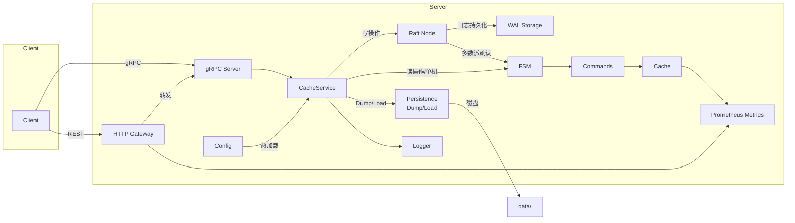
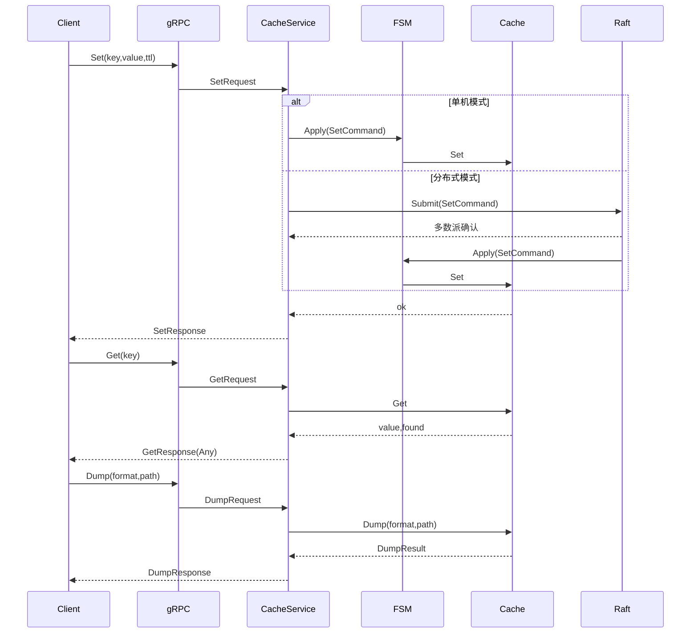

# 架构与数据流

- 入口 `pkg/cmd/main.go` 负责初始化日志、指标、配置、HTTP 网关与 gRPC 服务
- 服务层 `pkg/server/server.go` 将请求转为 `command.*` 并通过 `pkg/fsm` 应用到 `pkg/cache`
- 分布式模式下，写操作通过 `pkg/raft` 实现共识后应用到 FSM
- 缓存层使用前缀树与小顶堆做键索引与过期管理
- 持久化模块 `pkg/cache/persistence.go` 支持 Dump/Load，采用原子写入策略
- 配置管理 `pkg/config/config.go` 支持 YAML 加载、原子配置与热重载
- 指标通过 `Prometheus` 暴露在 `:2112/metrics`

## 模块边界
- 接口层：`pkg/pb` (Protobuf)、`pkg/server` (gRPC/HTTP)
- 领域层：`pkg/fsm`、`pkg/command`
- 共识层：`pkg/raft` (Raft 选举、日志复制、WAL 持久化)
- 缓存引擎：`pkg/cache` (CRUD、TTL 过期、前缀/正则搜索、Dump/Load 持久化)
- 基础设施层：`pkg/config` (配置管理)、`pkg/log` (日志)、`pkg/metrics` (指标)、`pkg/utils` (工具)
- 客户端：`pkg/client` (gRPC 客户端 SDK)

## 现状评估
- 读写分离通过 `InstrumentedRWMutex` 与过期清理协程实现
- 搜索支持前缀与正则，利用 Radix 前缀树提升效率
- 持久化支持二进制和 JSON 双格式，原子写入保证数据安全
- 优雅关闭 8 步流程：gRPC → Gateway → Raft → Dump → Cache → Config → Metrics → Logger
