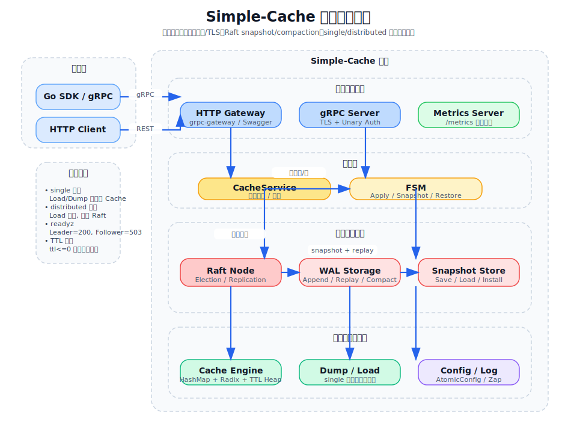
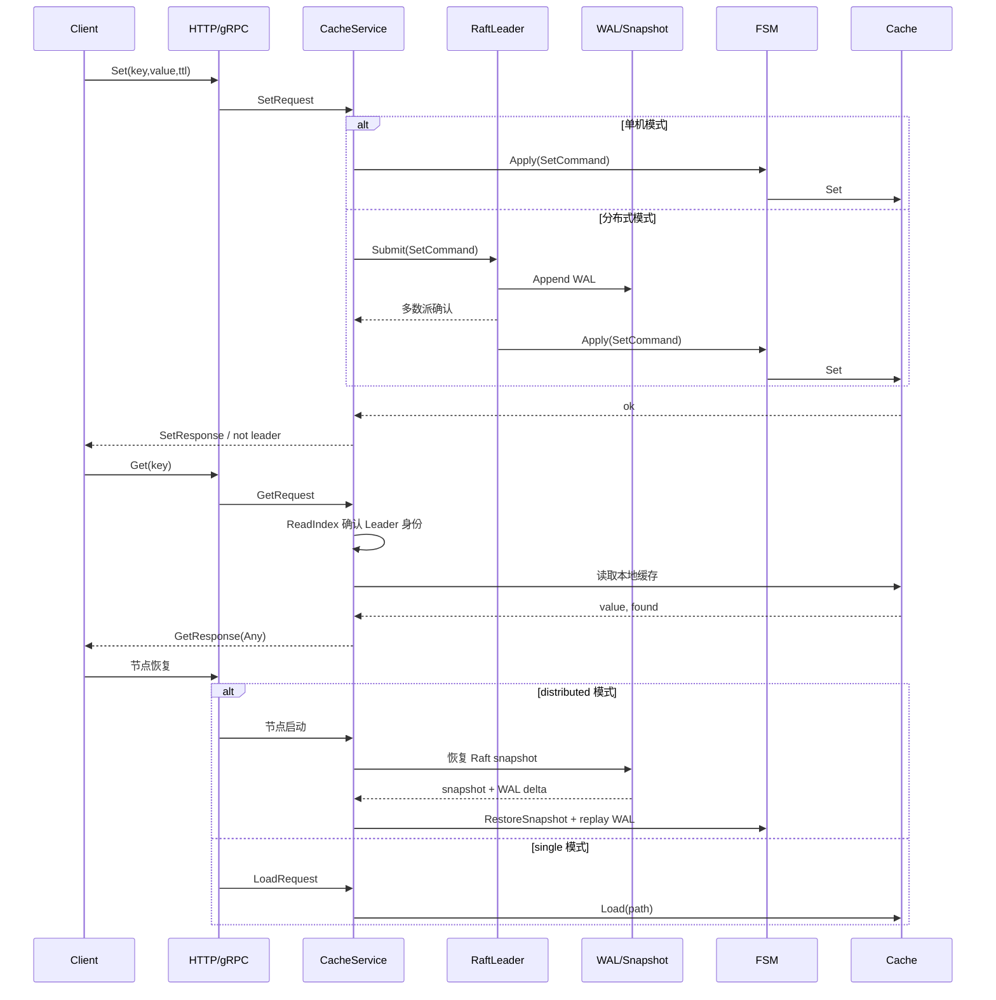

# 架构与数据流



```mermaid
flowchart LR
    subgraph Client
      CLI[Client / SDK]
    end
    subgraph Server
      GW[HTTP Gateway + Swagger]
      GRPC[gRPC Server]
      ADMIN[Admin SPA<br/>React 18 SPA @ /admin/]
      ADMIN_API[Admin API Handlers<br/>status/metrics/config/watch SSE]
      CS[CacheService]
      FSM[FSM]
      CMD[Commands]
      C[Cache]
      RAFT[Raft Node]
      STORE[WAL + Snapshot Storage]
      PERSIST[Cache Persistence<br/>Dump/Load]
      AUTH[Auth / TLS / CORS]
      METRICS[Prometheus Metrics]
      LOG[Logger]
      CFG[Config]
    end

    CLI -->|gRPC| GRPC
    CLI -->|REST| GW
    GW -->|转发| GRPC
    GRPC --> AUTH
    AUTH --> CS
    CS -->|写操作| RAFT
    RAFT -->|WAL / Snapshot| STORE
    RAFT -->|提交并应用| FSM
    RAFT -->|追平落后 Follower| RAFT
    CS -->|单机写/读| FSM
    CS -->|分布式读 (ReadIndex)| C
    FSM --> CMD
    CMD --> C
    CS -->|Dump/Load| PERSIST
    PERSIST -->|磁盘| DATA[data/]
    CS -->|发布事件| WATCH[WatchService]
    C --> METRICS
    CS --> LOG
    GW --> METRICS
    CFG -->|热加载| CS
    ADMIN -->|XHR| ADMIN_API
    ADMIN_API -->|聚合状态| CS
    ADMIN_API -->|订阅事件| WATCH
    ADMIN_API -->|指标汇总| METRICS
```

- 入口 `pkg/cmd/main.go` 负责初始化日志、配置、TLS/鉴权、HTTP 网关、gRPC 服务、Admin API 和 metrics
- 服务层 `pkg/server/server.go` 将请求转为 `command.*` 并通过 `pkg/fsm` 应用到 `pkg/cache`
- `pkg/server/admin.go` 提供 Admin API（状态聚合、指标汇总、配置视图、Watch SSE 代理），供前端 SPA 调用
- `pkg/cmd/admin.go` 通过 `//go:embed` 嵌入 React SPA 静态文件，提供 `/admin/` catch-all 路由
- 分布式模式下，写操作通过 `pkg/raft` 实现共识、WAL 持久化、snapshot/compaction，再应用到 FSM
- 分布式读采用 ReadIndex 协议保证线性一致，Follower 直接返回 `FailedPrecondition`
- 集群模式下 Client SDK (`NewCluster`) 通过 health 探针自动发现 Leader、自动重试/切主
- WatchService 提供发布/订阅能力，在 Set/Del/Expire 后推送事件给匹配模式的订阅者；SSE 端点将 gRPC server-streaming 转换为浏览器兼容的 Server-Sent Events
- 缓存层使用 HashMap + Radix Tree + Min-Heap/ExpirationIndex + LRU list 维护读写、搜索与 TTL
- `pkg/cache/persistence.go` 的 Dump/Load 主要用于 single 模式缓存持久化；distributed 模式恢复依赖 Raft snapshot + WAL replay
- 配置管理 `pkg/config/config.go` 支持 YAML 加载、原子配置与有限热重载
- 指标通过 `Prometheus` 暴露在独立 Metrics 端口



## 模块边界
- 接口层：`pkg/pb` (Protobuf 生成代码)、`pkg/server` (gRPC/HTTP，含 `auth.go` 认证中间件、`watch.go` WatchService、`admin.go` Admin API)
- 领域层：`pkg/fsm` (状态机 Apply/Snapshot/Restore)、`pkg/command` (命令定义 + `codec.go` 序列化/反序列化)
- 共识层：`pkg/raft` (Raft 选举、日志复制、ReadIndex、snapshot/compaction、InstallSnapshot、成员变更，含 `peer.go` 地址规范化)
- 缓存引擎：`pkg/cache` (CRUD、TTL 过期、LRU 淘汰、前缀/正则搜索、Dump/Load 持久化)
- 基础设施层：`pkg/config` (YAML 加载、AtomicConfig、Watcher 热重载)、`pkg/log` (日志 plugin + lumberjack)、`pkg/metrics` (Prometheus 指标 + InstrumentedRWMutex)、`pkg/utils` (pb.Any 类型转换)
- 客户端：`pkg/client` (gRPC 客户端 SDK，含 NewCluster 自动 Leader 切主、Watch 自动重连、BatchSetStream 流式批量)、`pkg/client/resolver` (gRPC Name Resolver `simplecache://` 协议)
- 管理后台：`frontend/` (React 18 + TypeScript + Vite，含 i18n 中英文切换)、`pkg/cmd/admin.go` (embed SPA + catch-all)、`pkg/cmd/admin-dist/` (构建产物嵌入)
- 入口：`pkg/cmd/main.go` (10 步优雅关闭 + 集群管理 HTTP 端点 + Admin API 注册 + Swagger UI)

## 现状评估
- 读写分离通过 `InstrumentedRWMutex` 与过期清理协程实现
- 搜索支持前缀与正则，利用 Radix 前缀树提升效率
- 支持 LRU 淘汰策略，达到 max_keys 时自动淘汰最近最少使用的 key
- 持久化支持二进制和 JSON 双格式，原子写入保证数据安全；Raft 侧额外支持 snapshot 与 WAL compaction
- 分布式读通过 ReadIndex 协议保证线性一致，避免 stale read
- Token 鉴权覆盖 gRPC (UnaryInterceptor) 与 HTTP (Middleware)，支持 x-api-token / Bearer 双格式
- WatchService 支持 pattern 匹配订阅，每订阅者 buffer 64 条事件，客户端 SDK 支持自动重连
- 优雅关闭 10 步流程：gRPC → Gateway → Raft → Dump → Cache → Watch → Config → Metrics → Logger
- Admin UI 内嵌 React 18 SPA，通过 `//go:embed` 嵌入二进制，启动即用；Watch 通过 SSE 代理适配浏览器环境
- 管理后台支持中英文国际化（70+ 翻译键），浏览器语言自动检测
