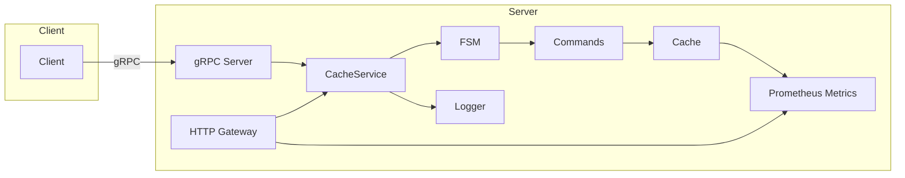
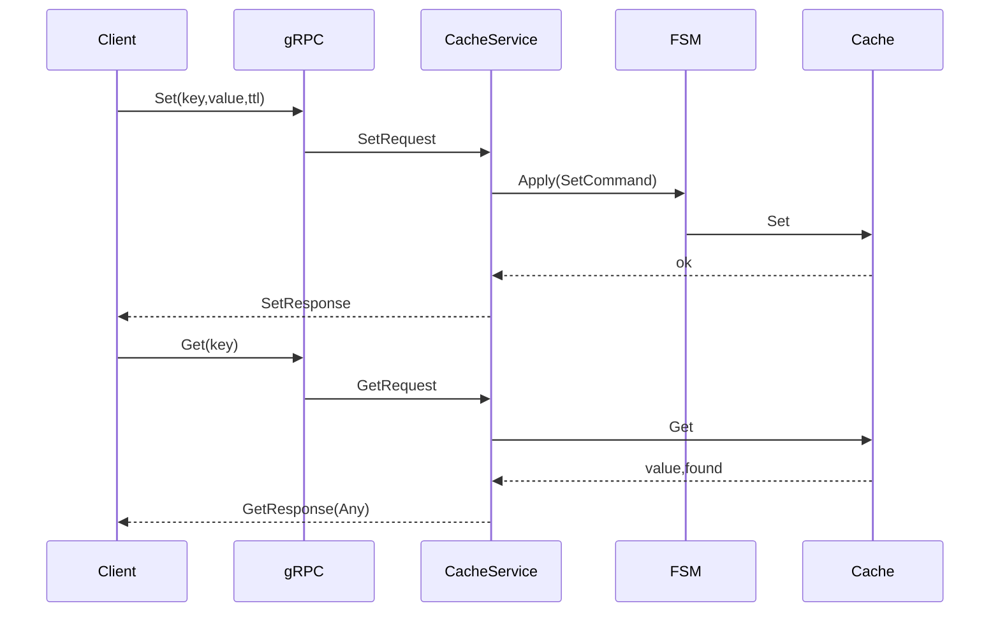

# 架构与数据流

- 入口 `pkg/cmd/main.go` 负责初始化日志、指标、HTTP 网关与 gRPC 服务
- 服务层 `pkg/server/server.go` 将请求转为 `command.*` 并通过 `pkg/fsm` 应用到 `pkg/cache`
- 缓存层使用前缀树与小顶堆做键索引与过期管理
- 指标通过 `Prometheus` 暴露在 `:2112/metrics`

## 模块边界
- 接口层：`pkg/pb` (Protobuf)、`pkg/server` (gRPC/HTTP)
- 领域层：`pkg/fsm`、`pkg/command`
- 基础设施层：`pkg/cache`、`pkg/log`、`pkg/metrics`、`pkg/utils`

## 现状评估
- 读写分离通过 `RWMutex` 与过期清理协程实现
- 关键路径日志较多，建议在生产环境降低等级
- 搜索支持前缀与正则，利用 Radix 前缀树提升效率
