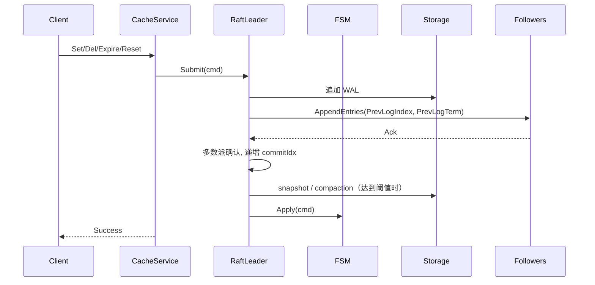

# Raft 集成方案

## 目标
- 提供强一致的写路径：仅 Leader 受理写入，提交后应用到 FSM
- 线性一致读：Leader 处理 `Get`，Follower 返回 `FailedPrecondition`
- 支持成员发现、变更、snapshot 恢复与日志压缩

## 组件
- Raft 节点：`pkg/raft/node.go`
- 日志与存储：`pkg/raft/storage.go`（WAL + Snapshot + Meta）
- 传输层：`pkg/raft/http_transport.go`（HTTP JSON，共享连接池）
- 消息：`AppendEntries`、`RequestVote`、`InstallSnapshot`、`Heartbeat`

## 写路径

## 读路径
- Leader 直接读取
- Follower 返回 `FailedPrecondition` 错误（当前实现不做自动转发）

## 成员管理
- HTTP Admin：`/cluster/join`、`/cluster/leave`、`/cluster/peers`
- 成员变更通过 Raft 日志提交后再生效，并持久化到本地 meta

## 持久化
- WAL：`{data_dir}/raft-<nodeID>.wal`
- Snapshot：`{data_dir}/raft-<nodeID>.wal.snapshot`
- Cache 快照：`{data_dir}/cache-<nodeID>.dump`（独立于 Raft，每个节点自行管理）
  - distributed 模式下 `Load` 已禁用，避免绕过共识直接改本地状态机
  - single 模式下仍可用于进程重启恢复、数据迁移等场景
  - 详细设计参见 [cache-persistence.md](cache-persistence.md)
- 启动恢复顺序：先恢复 Raft snapshot，再回放 snapshot 之后的 WAL 增量日志
- 当已应用日志数超过 `snapshot_threshold` 时，节点会创建新的 snapshot 并 compact 已覆盖的 WAL

## 容错
- 选举超时抖动（`election_ms + random(0..election_ms)`），避免雪崩
- 心跳周期可调，网络分区后自动选举恢复
- 日志一致性检查：`PrevLogIndex` + `PrevLogTerm`，并支持冲突截断与 WAL replay 恢复
- follower 落后到日志已被 compact 时，Leader 会发送 `InstallSnapshot`
