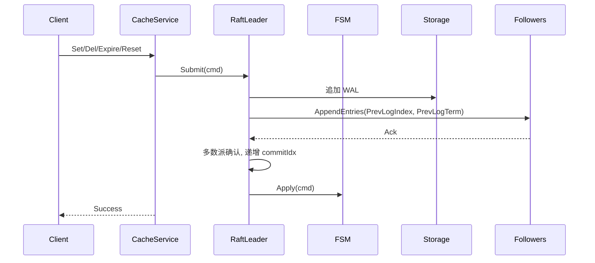

# Raft 集成方案

## 目标
- 提供强一致的写路径：仅 Leader 受理写入，提交后应用到 FSM
- 线性一致读：Leader 处理 `Get`，Follower 返回 `FailedPrecondition`
- 支持成员发现、变更与日志持久化

## 组件
- Raft 节点：`pkg/raft/node.go`
- 日志与存储：`pkg/raft/storage.go`（文件 WAL）
- 传输层：`pkg/raft/http_transport.go`（HTTP JSON，共享连接池）
- 消息：`AppendEntries`、`RequestVote`、`Heartbeat`

## 写路径

## 读路径
- Leader 直接读取
- Follower 返回 `FailedPrecondition` 错误（不返回 Leader 地址，客户端可连接任意节点）

## 成员管理
- HTTP Admin：`/cluster/join`、`/cluster/leave`、`/cluster/peers`
- 配置热加载：更新 peers 后 Raft 动态变更

## 持久化
- WAL：`{data_dir}/raft-<nodeID>.wal`
- Cache 快照：`{data_dir}/cache-<nodeID>.dump`（独立于 Raft，每个节点自行管理）
  - Dump/Load 不经过 Raft 共识，直接操作本地 Cache
  - 适用于进程重启快速恢复、数据迁移等场景
  - 详细设计参见 [cache-persistence.md](cache-persistence.md)

## 容错
- 选举超时抖动（`election_ms + random(0..election_ms)`），避免雪崩
- 心跳周期可调，网络分区后自动选举恢复
- 日志一致性检查：`PrevLogIndex` + `PrevLogTerm`
