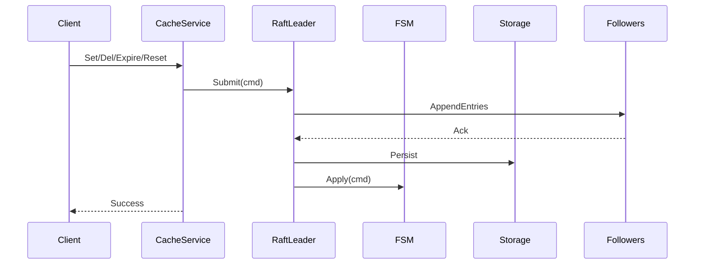

# Raft 集成方案

## 目标
- 提供强一致的写路径：仅 Leader 受理写入，提交后应用到 FSM
- 线性一致读：Leader 处理 `Get`，Follower 返回重定向
- 支持成员发现、变更与日志持久化

## 组件
- Raft 节点：`pkg/raft/node.go`
- 日志与存储：`pkg/raft/storage.go`（文件 WAL）
- 传输层：`pkg/raft/http_transport.go`（HTTP JSON）
- 消息：`AppendEntries`、`RequestVote`、`Heartbeat`

## 写路径

## 读路径
- Leader 直接读取或通过 ReadIndex
- Follower 返回 `ErrNotLeader` 附带 Leader 地址

## 成员管理
- HTTP Admin：`/cluster/join`、`/cluster/leave`
- 配置热加载：更新 peers 后 Raft 动态变更

## 持久化
- WAL：`data/raft-<nodeID>.wal`
- 快照：后续扩展

## 容错
- 选举超时抖动，避免雪崩
- 心跳周期可调，网络分区后自动选举恢复
